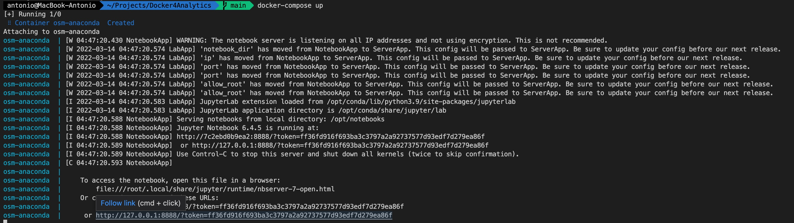
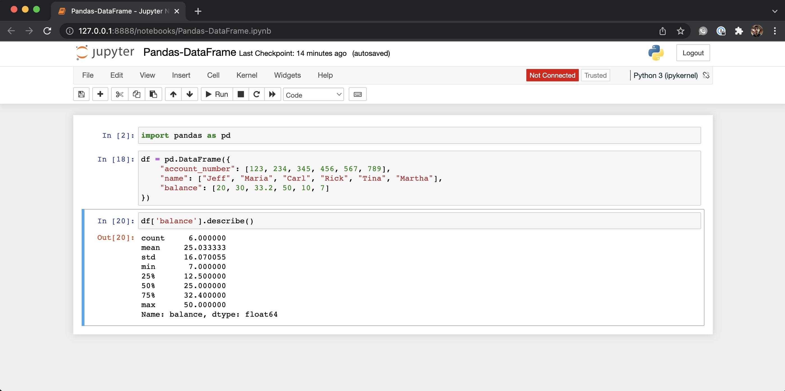

# Docker4Analytics

## Clone Repo
`git clone git@github.com:antonio83moura/Docker4Analytics.git`

## Construir Imagem 
`docker build --tag osm .`

## Iniciar Container
`docker-compose up`

## Notebook
